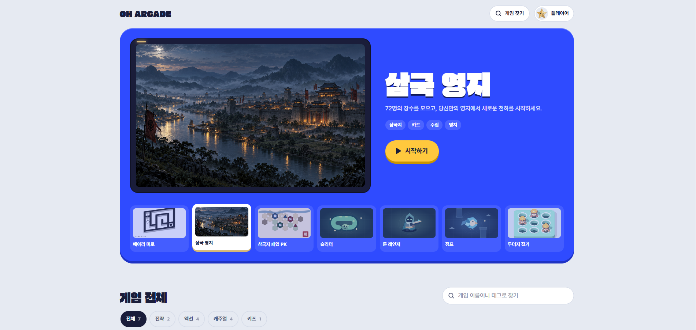
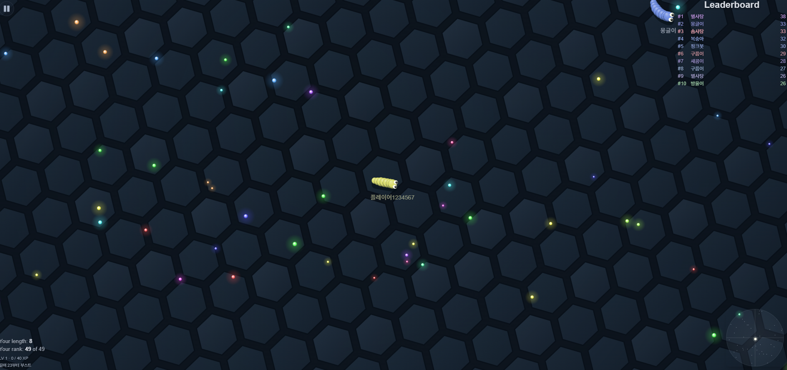

# GH ARCADE

브라우저에서 바로 할 수 있는 웹 게임 모음입니다.   
홈 화면은 게임기 옆에 카트리지가 꽂혀 있는 선반 느낌으로 만들어보았습니다.

> 배포 주소: https://variety-gaming-platform.vercel.app/

| 메인 | 슬리더 |
| --- | --- |
|  |  |

## 만들게 된 계기

조카가 지렁이 게임(slither.io 같은 거)을 정말 좋아합니다.

그런데 slither.io 사이트가 가끔 막힐 때도 있고, 조카 맞춤으로 직접 만들어 보고 싶기도 해서 게임을 만들기 시작했습니다.

슬리더 하나를 만들고 나니 생각보다 재밌어서 점프, 두더지 잡기, 기억력 게임 같은 것들을 하나씩 늘려 갔습니다. 조카 사진을 캐릭터로 넣어줬더니 반응이 좋아서 "내 사진으로 캐릭터 만들기" 기능도 붙였어요.

그러다 보니 제가 하고 싶은 게임도 만들고 싶어졌습니다. 어릴 때 삼국지 11을 정말 오래 했는데, 그 느낌의 턴제 전략 게임(삼국지 패업 PK)과 장수를 모아 영지를 키우는 카드 게임(삼국 영지)까지 만들었습니다. 이 두 개는 솔직히 조카용이 아니라 제 거예요.

## 게임 목록

| 게임 | 장르 | 한 줄 설명 |
| --- | --- | --- |
| 별빛 원정대 | 전술 RPG | 쿼터뷰 전장에서 동료 4명을 지휘하는 턴제 모험. 대화·마법·성장·3개 전투 |
| 슬리더 | 액션 | 별 먹고 커지는 지렁이 게임. 봇 AI, 레벨업·능력 성장 |
| 점프 | 액션 | 장애물 사이를 날아가는 게임. 스테이지 진행 |
| 룬 레인저 | 액션 RPG | 자동 사격 + 레벨업으로 몰려오는 적을 버티는 생존 게임. 직업 선택 |
| 두더지 잡기 | 캐주얼 | Three.js로 만든 3D 두더지, 30초 순발력 게임 |
| 메아리 미로 | 캐주얼 | 내 사진 캐릭터로 하는 2.5D 미로 탈출 |
| 삼국지 패업 PK | 전략 | 삼국지 11 방식 육각 턴제 전략. 내정 + 전투 + 공성, 3D 지도 |
| 삼국 영지 | 전략 | 장수 72명 수집, 부대 편성, 영지 육성, 토벌 |
| 기억력 / 색깔 맞추기 / 풍선 | 키즈 | 유아용. 아직 다듬는 중이라 허브에서는 "준비 중"으로 막아둠 |

## 기술 스택

- **프론트**: React 19, TypeScript, Vite 6, Tailwind CSS 4
- **렌더링**: Canvas 2D (대부분 게임), Three.js (두더지 잡기, 삼국지 3D 지도)
- **기타**: zod (저장 데이터 검증), Phosphor Icons, Pretendard
- **테스트**: Node 내장 테스트 러너 (`node --test`)
- **배포**: Vercel
- **삼국 영지 서버(apps/three-kingdoms-web)**: Next.js App Router, Prisma, Supabase(Postgres) — 아직 작업 중

## 폴더 구조

```text
src/
  platform/        허브 화면, 게임 등록(gameRegistry.ts)
  games/           게임별 폴더. 각자 game/ (엔진·규칙) + components/ (React UI) + hooks/
  shared/          공통 컴포넌트(일시정지, 게임오버), 하이스코어, 프로필·캐릭터, localStorage 래퍼
tests/             게임별 로직 테스트
apps/
  three-kingdoms-web/   삼국 영지를 서버 기반으로 옮기는 Next.js 프로젝트
```

새 게임을 추가할 때는 `src/games/`에 폴더를 만들고 `gameRegistry.ts`에 한 줄만 추가하면 허브에 나타납니다.

## 신경 쓴 부분

게임을 여러 개 만들다 보니, 처음 몇 개를 만들면서 고생했던 것들이 자연스럽게 공통 규칙이 됐습니다.

**게임 루프는 React 밖에 둡니다**
처음에는 게임 상태를 React state로 들고 있었는데, 매 프레임 리렌더가 일어나서 모바일에서 버벅였습니다. 지금은 엔진(캔버스 + rAF 루프)이 상태를 직접 들고, 점수나 체력처럼 UI에 보여줄 값만 `uiStore`에 모아서 `useSyncExternalStore`로 React에 넘깁니다(`shared/hooks/useUISnapshot.ts`). UI 갱신도 일정 간격으로만 합니다.

**슬리더 충돌 처리**
봇과 별이 많아지면 전부 거리 비교하는 게 너무 무거워서, 공간 해시 그리드(`spatialGrid.ts`)로 주변 칸만 검사하도록 바꿨습니다. 탭을 갔다 오거나 프레임이 크게 밀리면 dt가 튀어서 벽을 뚫는 문제도 있었는데, dt에 상한을 두고 큰 dt는 쪼개서 두 번 업데이트하는 방식으로 해결했습니다.

**삼국지 패업은 턴제라 구조가 다릅니다**
실시간 게임이 아니라서 rAF 루프는 그리기 전용이고, 애니메이션이 없으면 루프를 멈춥니다. 가만히 있는 지도에서 CPU를 쓸 이유가 없으니까요. 턴 진행은 한 단계씩 나아가는 스텝 머신으로 짰고, AI도 플레이어와 똑같은 커맨드 함수를 거치게 해서 전투 규칙이 두 벌로 갈라지지 않게 했습니다. 자세한 이유는 [src/games/three-kingdoms/README.md](src/games/three-kingdoms/README.md)에 적어 두었습니다.

**테스트 가능하게**
게임 규칙 코드는 DOM을 모르게 하고, 난수는 시드로 주입합니다. 덕분에 브라우저 없이 `node --test`로 전투 결과, 성장 공식, 미로 생성 같은 것을 검증할 수 있습니다. 현재 테스트는 148개입니다.

**모바일**
조카가 거의 태블릿이나 폰으로 하기 때문에 터치 조작, 화면 크기, 세로 모드를 계속 손봤습니다. PC에서는 멀쩡한데 폰에서 깨지는 경우가 제일 많았어요.

**개인 사진은 저장소에 올리지 않았습니다**
캐릭터로 쓰는 가족 사진은 `.gitignore`로 제외했습니다. 클론해서 빌드할 때는 `public/1.jpg~3.jpg`, `src/shared/assets/1.jpg~3.jpg` 자리에 아무 이미지나 넣으면 됩니다. 사진 업로드 기능은 이 파일들 없이도 동작합니다.

## AI 도구 활용

이 프로젝트는 **Codex + Claude Code** 조합으로 개발했습니다.

게임 기획, 규칙, 밸런스, 화면 방향은 제가 정하고, 구현은 두 도구에 나눠 맡겼습니다. 결과물은 직접 플레이하면서 확인했고, 이상한 부분은 다시 지시하거나 직접 고쳤습니다. 한 도구가 짠 코드를 다른 도구로 리뷰하게 하는 식으로 교차 검증도 했어요.

해보면서 느낀 점은 이렇습니다.

- 처음에 "게임 하나 만들어줘" 식으로 던지면 그럴듯하긴 한데 구조가 매번 달랐습니다. 엔진/UI 분리, 저장 키 규칙 같은 공통 규칙을 먼저 정해 두고 나서부터는 게임이 늘어나도 코드가 덜 엉켰습니다.
- 밸런스나 손맛은 AI가 판단하지 못합니다. 결국 제가 수십 판씩 해보면서 수치를 조정해야 했습니다. (위·오 장수 능력치 조정 커밋 같은 것들)
- 테스트를 같이 만들게 하니, 수정할 때 다른 부분이 깨졌는지 바로 알 수 있어서 AI 작업 결과를 훨씬 믿고 넘길 수 있었습니다.

## 실행 방법

Node.js 22 이상 기준입니다.

```sh
npm install
npm run dev       # 개발 서버
npm test          # 테스트
npm run build     # 타입 체크 + 빌드
```

삼국 영지 서버 쪽은 `apps/three-kingdoms-web/README.md`를 참고해 주세요.
