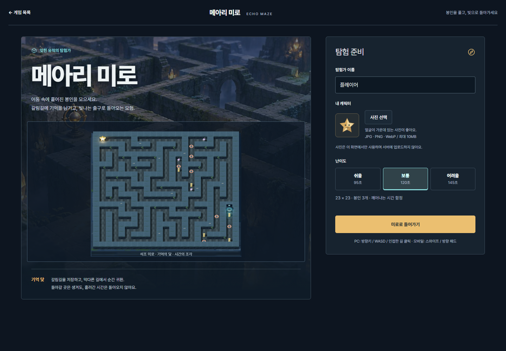
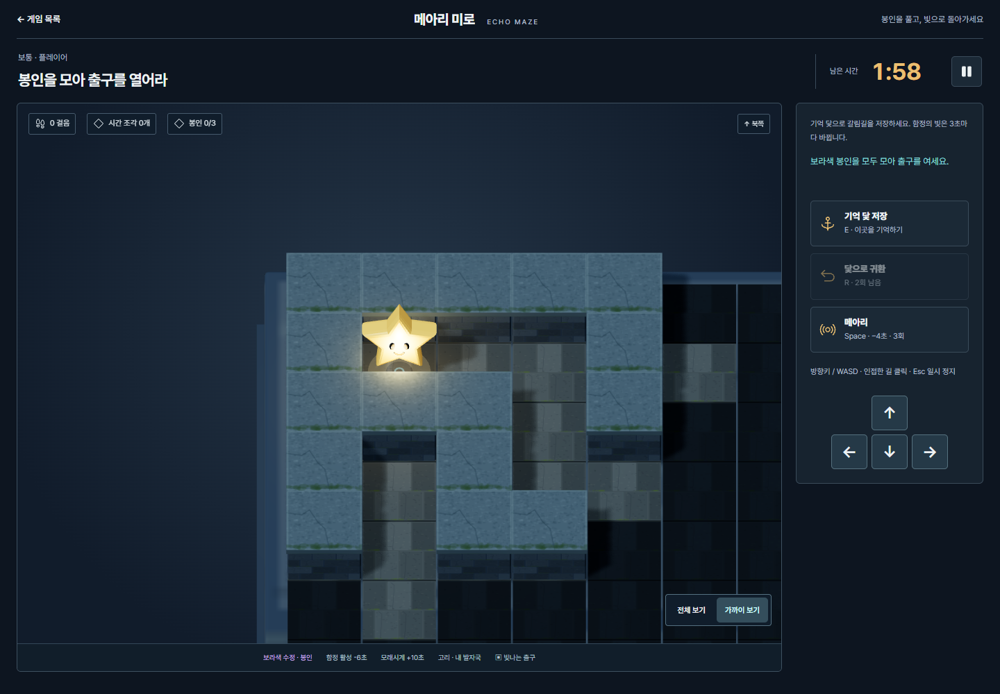
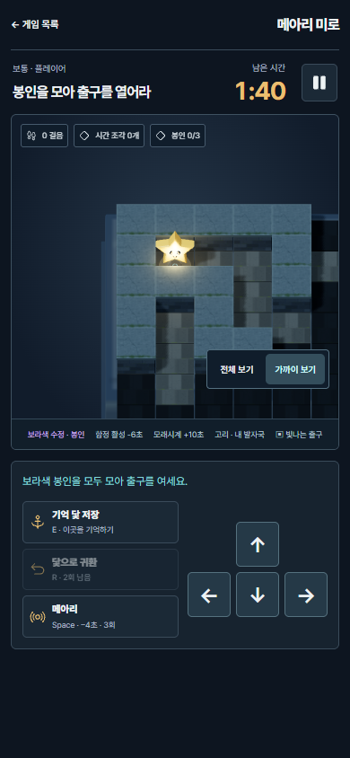

# 메아리 미로 그래픽 개선

허브 그림의 고대 유적 분위기를 실제 WebGL 게임에도 적용했다. 짙은 남색 화면에 석조 미로, 금빛 별 탐험가와 청록색 출구를 배치했다. 준비 화면의 배경은 기존 허브 이미지이며, 미리보기와 플레이 화면은 실제 게임 렌더러다.

- 벽돌 벽, 균열과 이끼가 있는 덮개 돌, 포장 바닥과 두께가 있는 기단.
- 입체 별, 눈과 미소, 발밑 조명. 사진을 선택하면 별의 얼굴에 원형 사진을 적용한다.
- 석조 아치 출구, 보라색 봉인, 모래시계, 기억 닻, 발자국과 메아리 파동.
- 가까이 보기와 전체 보기, 북쪽 기준 이동, 인접한 길을 클릭하는 PC 조작.
- 모바일에서 지도 아래 도구와 이동 패드를 나란히 배치. 일시정지 및 결과 대화상자에는 키보드 포커스 순환을 적용.
- 덩굴은 재질별로 병합하고 그림자는 시야 변경 때 갱신한다. 시야에 따라 변하는 인스턴스는 최초 프레임의 경계로 잘리지 않는다. 모션 감소 설정에서는 흔들림과 회전을 멈춘다.

## 확인

- `node --test tests/echo-maze.test.mjs`: 7개 통과.
- `npm run build -- --logLevel error`: 통과.
- 브라우저: 인접한 길의 마우스 좌표 변환 및 실제 이동, 키보드 닻 저장·귀환, 메아리 비용, 정지 중 시간 유지 확인.
- 키보드 입력으로 봉인 3개를 수집하고 출구까지 이동. 검증용 남은 시간을 늘려 경로 전체를 확인했다. 시간 초과와 새 미로 재시작도 확인했다.
- 터치 패드와 스와이프는 브라우저에서 PointerEvent를 보내 입력 처리를 확인했다. 실제 휴대전화 하드웨어 검증은 포함하지 않았다.
- 1440 × 1000, 390 × 844, 320 × 740 레이아웃 확인. 가로 넘침 없음. 사진 업로드와 기본 캐릭터 복원 확인.
- 일시정지 진입 시 계속 탐험 버튼에 포커스, Tab 이동 시 대화상자 안에서 순환 확인. 최종 브라우저 런타임 오류 없음.

